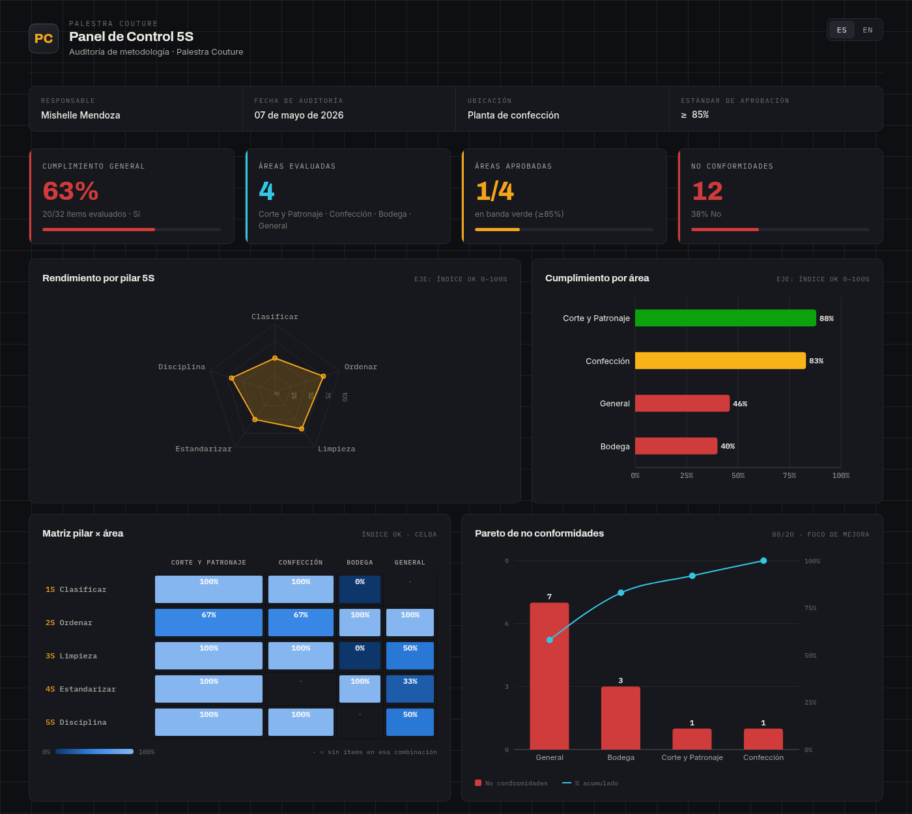

# Palestra Couture · Panel de Control 5S

Dashboard industrial interactivo para la auditoría de metodología **5S** de Palestra
Couture. Construido con **React + Vite + TypeScript + Recharts**. Tema oscuro
grafito, bilingüe ES/EN, filtros en vivo y datos editables desde un solo archivo.



## Qué muestra

- **KPIs**: cumplimiento general (63%), áreas evaluadas, áreas aprobadas y no conformidades.
- **Radar** de los 5 pilares (Clasificar · Ordenar · Limpieza · Estandarizar · Disciplina).
- **Cumplimiento por área** (barras, coloreadas por estado 🟢🟡🔴).
- **Matriz pilar × área** (heatmap) y **Pareto** de no conformidades.
- **Tabla de detalle** con filtros por área, pilar y resultado.

## Requisitos

- Node.js 20 o superior.

## Desarrollo

```bash
npm install        # instala dependencias
npm run dev        # servidor local en http://localhost:5173
npm run build      # compila a dist/ (producción)
npm run preview    # sirve el build de producción localmente
```

## Editar los datos de la auditoría

Todo sale de **un solo archivo**: `src/data/audit.ts`.

- `AUDIT_META` — empresa, responsable, fecha, umbrales de aprobación.
- `AUDIT_ITEMS` — las 32 preguntas, cada una con `area`, `pillar` y `response` (`'si' | 'no' | 'na'`).

Al guardar, **todos los KPIs y gráficos se recalculan solos**. La metodología de
puntaje es la del formato MMH: `Índice OK = Sí ÷ (Total − N/A)`, con umbrales
🟢 ≥85% · 🟡 70–85% · 🔴 <70%.

> El pilar 5S de cada pregunta se clasificó a partir del contenido del ítem (el
> Excel original está organizado por área, no por pilar). Si querés reasignar
> alguno, cambiá el campo `pillar` de esa fila.

## Cambiar el logo

En `src/components/Header.tsx`, reemplazá el bloque `<div className="brand-mark">PC</div>`
por `` y poné
tu archivo en `public/logo.svg`.

---

## Subirlo a GitHub Pages (incluso en otra cuenta)

El proyecto ya trae el workflow `.github/workflows/deploy.yml`: **GitHub construye
y publica solo** en cada push a `main`. No necesitás compilar ni autenticar el
deploy a mano.

### Paso a paso con `gh` (recomendado)

```bash
# 1. Iniciar sesión en la OTRA cuenta de GitHub
gh auth login          # elegí GitHub.com → HTTPS → login con navegador

# 2. Desde la carpeta del proyecto, inicializar git
cd palestra-5s-dashboard
git init -b main
git add .
git commit -m "Panel de control 5S Palestra Couture"

# 3. Crear el repo en la cuenta activa y subir todo
gh repo create palestra-5s-dashboard --public --source=. --push
```

Luego, en el repo: **Settings → Pages → Build and deployment → Source: GitHub
Actions**. En ~1 minuto queda publicado en
`https://TU-USUARIO.github.io/palestra-5s-dashboard/`.

### Alternativa sin `gh` (con token)

```bash
git init -b main
git add . && git commit -m "Panel 5S"
# creá el repo vacío desde la web github.com/new (con la otra cuenta)
git remote add origin https://github.com/TU-USUARIO/palestra-5s-dashboard.git
git push -u origin main
# te pedirá usuario y contraseña: usá tu usuario y un
# Personal Access Token (github.com/settings/tokens) como contraseña
```

Después activá **Settings → Pages → Source: GitHub Actions**.

> `vite.config.ts` usa `base: './'`, así que funciona en cualquier subruta
> `usuario.github.io/repositorio/` sin tocar nada.
